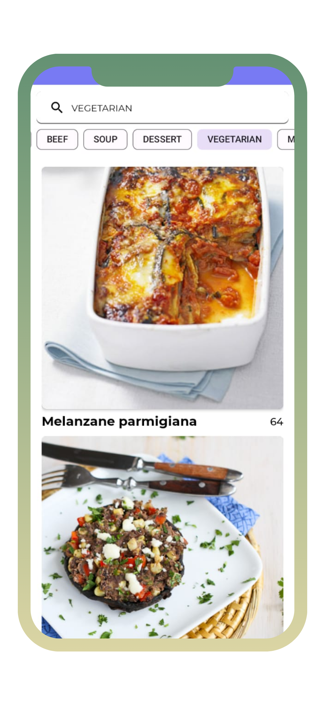
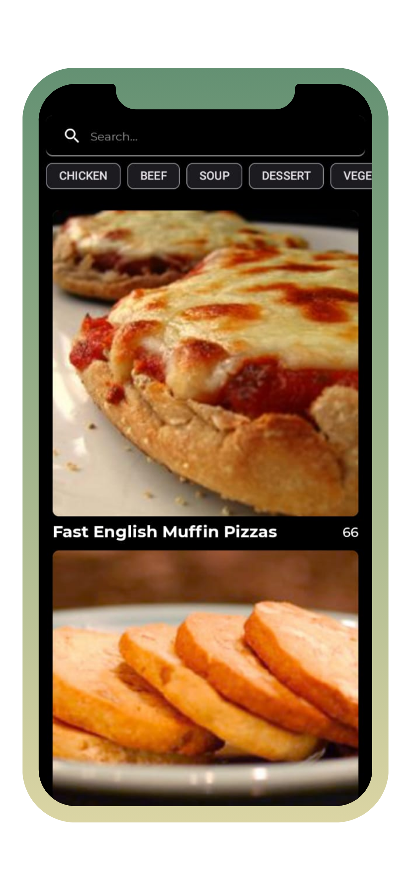

# Food2Fork

This project is a recipe app called "Food2Fork" designed for food enthusiasts. It allows users to easily search and find delicious recipes, filter them by categories, and even save their favorite recipes for future reference.
This project inspired by [food2fork-compose](https://github.com/mitchtabian/food2fork-compose) created by Mitch Tabian and written in Kotlin.

## App design and architecture
Project is based on MVVM architecture, mostly written in Kotlin using Android Jetpack components and libraries.
App utilises offline first approach and implements "Single Activity - multiple Fragments" navigation pattern.

Android Jetpack Architecture Components used:
- Kotlin
- ViewModel
- LiveData
- Retrieve Network Data from API (REST API)
- Database caching
- Monitoring Network Connectivity
- Room
- ViewBinding 
- Navigation component

Dependency injection:
- Dagger-Hilt

Kotlin libraries:
- Kotlin Coroutines
- various ktx extensions

UI is utilising a dual-theme approach, This app automatically switches between light and dark themes based on the user's mobile phone theme.

## Credits
[Food2Fork RESTful API](https://food2fork.ca/)

Project uses third-party libraries:
- [Lottie Animations](https://lottiefiles.com/blog/working-with-lottie/getting-started-with-lottie-animations-in-android-app/) for splash screen and loading dialog.
- [Retrofit](https://github.com/square/retrofit) for making RESTful API calls
- [Timber](https://github.com/JakeWharton/timber) logging
- [Dagger-Hilt](https://developer.android.com/training/dependency-injection/hilt-android) dependency injection
- [Glide](https://github.com/bumptech/glide) image loading library
- [Android-Viewbinding](https://github.com/yogacp/android-viewbinding) for viewbinding

## License
Licensed under the [GNU General Public License v3.0](LICENSE)
